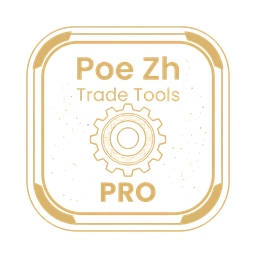

<div align="center">
  
  <h1>Poe Zh Trade Tools Pro</h1>
  <p>流亡黯道官方交易站的輔助工具 — 支援繁體 / 簡體中文化。</p>
  <p>A companion for the official Path of Exile trade site — with Traditional / Simplified Chinese localization.</p>
</div>

> **本擴充與 Grinding Gear Games 無關,未獲其授權或背書;「Path of Exile」為 GGG 之商標。**
>
> Not affiliated with, authorized, or endorsed by Grinding Gear Games.
> "Path of Exile" is a trademark of Grinding Gear Games.

> **適用範圍 / Scope:** 本工具的改動以**《流亡黯道》一代(PoE1)**為主;<br>
> 二代(PoE2)僅做交易工具中文化,市集部分並未做任何修改。<br>
> 注意:本工具不支援中國服(騰訊)。
>
> This tool focuses on **Path of Exile 1 (PoE1)**;<br>
> For Path of Exile 2, only the trade tool is localized — the trade site itself is not modified.<br>
> Note: this tool does not support the Tencent (China) realm.

---

## 中文

**Poe Zh Trade Tools Pro** 是一個 Chrome 擴充,為流亡黯道官方交易站加入輔助側邊欄
與多項便利功能,並可選擇將交易站中文化(繁體或簡體),且中英雙向皆可搜尋。

### 功能
- 書籤與資料夾:儲存交易搜尋
- 搜尋歷史
- 結果工具:混沌石 / 神聖石 / 崇高石等值定價(透過 poe.ninja)、快速屬性 / 武器 /
  價格篩選預設
- 可選的繁體 / 簡體中文化:篩選器、詞綴、物品名稱、通貨全面中文化,中英雙向皆可搜尋
- 支援傳奇物品/技能寶石一鍵開啟 PoeDB、PoeWiki
- 所有資料(書籤、歷史、設定)都留在本機

### 安裝
- Chrome 線上應用程式商店:https://chromewebstore.google.com/detail/poe-zh-trade-tools-pro/olebcconlpeiohdbglmhdggklbajcelc
- Firefox 附加元件(AMO):https://addons.mozilla.org/zh-TW/firefox/addon/poe-zh-trade-tools-pro/
- 從原始碼:見下方 **Build**,再到 `chrome://extensions` → 開發者模式 →
  載入未封裝項目,選 `build/chrome-mv3`。

---

## English

**Poe Zh Trade Tools Pro** is a Chrome extension that adds a companion sidebar
and quality-of-life tools to the official Path of Exile trade website, and can
optionally translate the trade site into Traditional or Simplified Chinese with
search that works in both Chinese and English.

### Features
- Bookmarks and folders for saved trade searches
- Search history
- Result tools: Chaos / Divine / Exalted equivalent pricing (via poe.ninja),
  quick stat / weapon / price filter presets
- Optional Traditional / Simplified Chinese localization of stat filters, item
  mods, item names and currencies — bilingual (Chinese + English) search
- One-click PoeDB / Poe Wiki links on unique items & skill gems
- All data (bookmarks, history, settings) stays on your device

### Install
- Chrome Web Store: https://chromewebstore.google.com/detail/poe-zh-trade-tools-pro/olebcconlpeiohdbglmhdggklbajcelc
- Firefox Add-on (AMO): https://addons.mozilla.org/firefox/addon/poe-zh-trade-tools-pro/
- From source: see **Build** below, then load `build/chrome-mv3` via
  `chrome://extensions` → Developer mode → Load unpacked.

### Build
```bash
pnpm install
pnpm run build:chrome   # output in build/chrome-mv3
```

### Privacy
No personal data is collected or transmitted. Everything is stored locally.
See [store/PRIVACY-POLICY.md](store/PRIVACY-POLICY.md).

---

## Credits / 致謝
本專案基於 KroxiLabs 的開源專案 **[Poe Trade Plus](https://github.com/KroxiLabs/Kroxitrade)**(MIT 授權);繁體 / 簡體中文化與整合由 **MooHui Dev** 製作。

Based on the open-source **[Poe Trade Plus](https://github.com/KroxiLabs/Kroxitrade)**
by KroxiLabs, licensed under the MIT License. The Traditional / Simplified
Chinese localization and integration is by **MooHui Dev**.

部分中文翻譯資料參考自 **[PoEDB](https://poedb.tw/)**(chuanhsing 製作),特此致謝。

Some Chinese translation data references **[PoEDB](https://poedb.tw/)** (by chuanhsing) — thanks!

## License / 授權

本專案**程式碼**以 [MIT License](LICENSE) 授權(原始專案 © KroxiLabs「Poe Trade Plus」;繁 / 簡中文化分支 © MooHui Dev)。

`data/` 目錄內的**翻譯資料檔為第三方內容,不在 MIT 授權範圍**,各依其來源授權:
- 《Path of Exile》遊戲文本(詞綴、物品 / 傳奇名稱、通貨等)為 **Grinding Gear Games** 之智慧財產;本專案僅作為玩家社群中文化工具使用。
- 部分中文翻譯資料參考自 **[PoEDB](https://poedb.tw/)**(chuanhsing)。
- 簡體中文轉換使用 **[OpenCC](https://github.com/BYVoid/OpenCC)** 衍生字典(Apache-2.0)。

「Path of Exile」為 Grinding Gear Games 之商標;本專案為玩家社群工具,與 GGG 無關。

---

The extension **code** is under the [MIT License](LICENSE) (original © KroxiLabs "Poe Trade Plus"; Traditional / Simplified Chinese localization fork © MooHui Dev).

The **translation data files under `data/` are third-party content and are NOT covered by the MIT license**; each remains under its own source's terms:
- Path of Exile game text (stat descriptions, item / unique names, currencies) is the intellectual property of **Grinding Gear Games**; used here solely for a community localization tool.
- Some Chinese translation data references **[PoEDB](https://poedb.tw/)** (chuanhsing).
- Simplified-Chinese conversion uses dictionaries derived from **[OpenCC](https://github.com/BYVoid/OpenCC)** (Apache-2.0).

"Path of Exile" is a trademark of Grinding Gear Games. This is a community fan tool, not affiliated with GGG.
